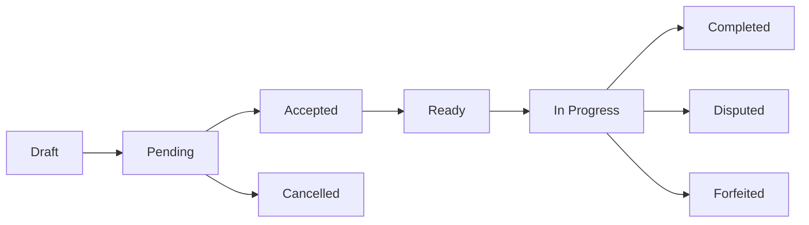

Matches are the core of TeamBattles. Challenge other teams and prove your skill.

## Match Lifecycle

| Status          | Meaning                      | What Happens Next              |
| --------------- | ---------------------------- | ------------------------------ |
| **Draft**       | Created but not published    | Publish to make visible        |
| **Pending**     | Published, awaiting opponent | Teams send acceptance requests |
| **Accepted**    | Both teams confirmed         | Prepare rosters and check in   |
| **Ready**       | Teams checked in             | Match can begin                |
| **In Progress** | Match being played           | Submit scores when done        |
| **Completed**   | Finished, scores confirmed   | Stats updated                  |
| **Cancelled**   | Cancelled by creator         | No stats recorded              |
| **Disputed**    | Active dispute               | Awaiting admin review          |
| **Forfeited**   | Team forfeited               | Win awarded to other team      |

## Match Flow

## Limits

| Setting        | Limit                        |
| -------------- | ---------------------------- |
| Series Length  | Best of 1, 3, 5, or 7        |
| Schedule (min) | 1 hour from now              |
| Schedule (max) | 7 days from now              |
| Active Roster  | Minimum 1 player             |
| Screenshots    | Max 10 per score (2 MB each) |

## Team Size by Game

| Game                       | Default | Matchmaking            |
| -------------------------- | ------- | ---------------------- |
| Call of Duty: Black Ops 7  | 4       | Available              |
| Valorant                   | 5       | Available              |
| League of Legends          | 5       | Available              |
| Call of Duty: Black Ops 6  | 4       | Coming soon            |
| Counter-Strike 2           | 5       | Strategy editor only   |
| Rocket League              | 3       | Coming soon            |
| Apex Legends               | 3       | Coming soon            |
| Fortnite                   | 4       | Coming soon            |
| Marvel Rivals              | 6       | Coming soon            |
| Battlefield 6              | 4       | Coming soon            |
| Old School RuneScape       | 1       | Coming soon            |

<Note>
	Games marked **Coming soon** are visible across the platform but cannot currently host matchmaking
	or accept challenges. **Counter-Strike 2** is supported in the [Strategy editor](/strategy/managing-strategies)
	only - match creation, leagues, and ranks are not yet wired up.
</Note>

## Next Steps

<CardGroup cols={2}>
	<Card title="Create a Match" icon="plus" href="/matches/create">
		Challenge other teams
	</Card>
	<Card title="Match Settings" icon="gear" href="/matches/settings">
		Maps, series, and more
	</Card>
</CardGroup>
