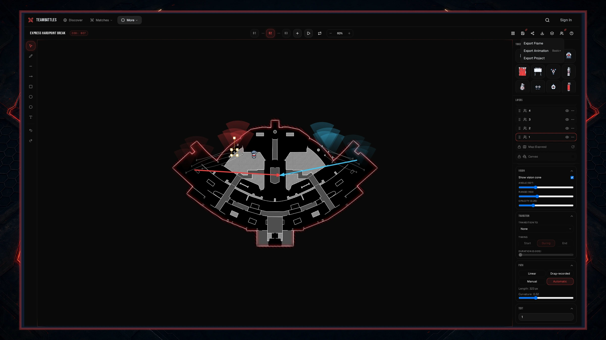
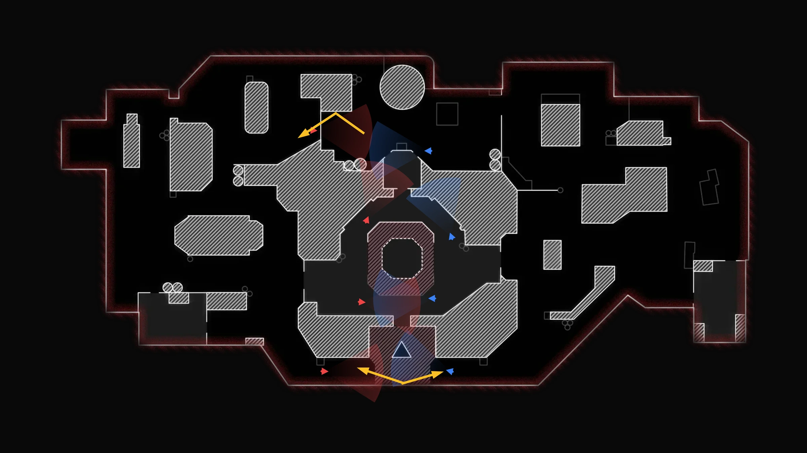

Opening the strategy editor starts you on the welcome screen, where you can begin something new or
pick up where you left off. Everything else - naming, sharing, deleting - happens without leaving the
editor.

To group related plays into a folder, see [Managing your boards](/strategy/managing-boards).

## The welcome screen

<Steps>
	<Step title="Start a new strategy">
		Choose a game, then a map - or one of your own [custom maps](/strategy/custom-maps) if your plan
		includes them.
	</Step>
	<Step title="Continue working">
		Pick up something recent. Each card shows a thumbnail, whether it is saved on this device or to
		your account, when you last touched it, and a menu to **Open**, **Rename**, **Duplicate**, or
		**Delete**.
	</Step>
</Steps>

**What's this?** on the welcome screen opens the shortcuts and help reference.

<Note>
	To change the map on a strategy you already have open, use **Change map** in the Layers panel.
</Note>

### Players already on the map

On maps that come with spawn information - every Black Ops 6 and Black Ops 7 map, all ten
Counter-Strike 2 maps, and League of Legends Summoner's Rift and Howling Abyss - a new strategy opens
with player tokens already placed at the two spawns rather than on an empty board. Rainbow Six Siege
maps, League of Legends Arena maps, and custom maps start empty; drag tokens in from the **Tokens**
panel as usual.

- **One color per side.** One spawn gets blue tokens, the other red, so the two teams read apart at a
  glance. On Black Ops 7 blue is JSOC and red is Guild; on Black Ops 6 blue is Crimson One and red is
  Pantheon; on Counter-Strike 2 blue is the CT spawn and red is the T spawn; on League of Legends
  blue is the bottom-left base and red is the top-right. Recolor any of them from **Properties**.
- **The right number for the game.** Black Ops 6 and Black Ops 7 use four a side, so you get eight
  tokens. Counter-Strike 2 and League of Legends use five a side, so you get ten. Black Ops 7 casual
  matches are 6v6, but the editor always plans at the competitive size.
- **Both teams face each other.** Each side starts pointed at the other spawn, squared up to the
  nearest of north, south, east, or west. A handful of maps - Plaza is the clearest example - have a
  facing chosen by hand instead, to suit the way the map reads. Rotate any token yourself as normal.
- **One undo clears them all.** Press <kbd>Ctrl</kbd>+<kbd>Z</kbd> (<kbd>Cmd</kbd>+<kbd>Z</kbd> on a
  Mac) once to remove every one of them in a single step, and
  <kbd>Ctrl</kbd>+<kbd>Shift</kbd>+<kbd>Z</kbd> to bring them back.
- **Only on brand-new strategies.** They never reappear when you change the map on an existing
  strategy, duplicate one, or reopen a saved one.

<Note>
	Move, recolor, number, or delete these tokens like any other. They are ordinary player tokens -
	they just arrived by themselves.
</Note>

### Strategies kept on this device

Anything you create is saved in your browser as you go, and there is no limit on how many you can
keep. They carry a **Local** badge in the **Continue working** grid.

<Note>
	A strategy kept on this device lives **in this browser only**. It survives a reload or an
	accidental tab-close, but it will not appear in another browser or on another computer. Sign in
	and save it to your account to take it with you.
</Note>

Reloading the page reopens whichever strategy you had open.

Signed in, your account strategies appear in the same **Continue working** grid, marked **Saved**.

## Saving

Select **Save** in the editor header. What you see depends on whether you are signed in, and whether
this strategy is already on your account.

### Where to save it

Signed in, with a strategy that is not on your account yet, you choose:

<Steps>
	<Step title="Save to my account">
		Counts towards your plan's limit, and gives you a link you can [share and
		embed](/strategy/embedding). You then set the name, description, and who can see it, and
		whether it should keep saving itself.
	</Step>
	<Step title="Keep on this device">
		Leaves it in this browser. Device strategies are unlimited and private to you.
	</Step>
</Steps>

<Warning>
	A strategy kept on this device cannot be shared or embedded, and may be lost if you clear your
	browser data. Save to your account when you want a link, or a copy that follows you around.
</Warning>

Once a strategy is on your account, saving again just updates it.

### If you are signed out

Your strategy is already saved on this device. The Save dialog says so, and offers **Sign in** to put
it on your account, or **Keep on device** to carry on without one.

### If you have hit your limit

At your plan's limit, **Save** shows a small upgrade spark and offers you a choice instead of the
usual form:

- **Upgrade** to a plan that lets you save more. See [Subscriptions](/subscriptions).
- **Keep on device** so you do not lose the work.

## Downloading and importing

<Frame>
	
</Frame>

### The TeamBattles frame on images

The Export Frame dialog has a **Branded frame** switch. Turn it on and your image comes out mounted
in the TeamBattles look - the honeycomb background, a colored bar along the top edge, the logo, the
TeamBattles name, and your board's name - so a play posted into a channel still says what it is once
the filename is gone. It follows your own **Appearance** settings, so a board saved on the light
theme matches the site you are looking at.

It is off by default, because a strategy frame most often goes straight into a callout or a stream
overlay where a header band gets in the way. The frame paints a solid background, so turning it on
turns **Transparent background** off for that export.

New boards also start on your theme's own background color rather than a fixed near-black. A board
you already saved keeps whatever background it has, and you can change it any time from the canvas
settings.

### Watermarks

Images and animations you export carry a small `teambattles.gg` mark in the bottom-right corner on
Free and Basic accounts, and when you are signed out. Standard and Premium export without it.

The mark never sits over your drawing - it stays in the corner and scales with the size of the
export, so a triple-size export gets a proportionally sized mark rather than a tiny one. Project
files are never watermarked on any plan, because they are editable source rather than a finished
picture.

### Project files

You can download a whole strategy as a file you can open again later. Choose **Export Project** from
the **Export** menu, then pick one of two kinds:

<Steps>
	<Step title="Online copy">
		A small file that points back to your saved strategy. Opening it fetches the latest version and
		makes a fresh, editable copy. You have to have saved the strategy to your account first, since
		there is nothing to point at otherwise. Anyone can open it as long as the strategy is
		**Unlisted** or **Public** - a **Private** one only opens for you.
	</Step>
	<Step title="Offline copy">
		A complete file with everything inside it - stages, drawings, tokens, and the map image itself
		if you used a [custom map](/strategy/custom-maps). It works anywhere, so this is the one to
		hand to someone else.
	</Step>
</Steps>

<Note>
	Both kinds are free. Use an online copy to share a live link to your own work, and an offline copy
	when you need a file that stands on its own.
</Note>

<Warning>
	A custom map only shows for you, so an online copy of a custom-map strategy arrives without its
	background. Send an **offline copy** instead - the map image travels with it.
</Warning>

### Opening a file

On the welcome screen, choose **Import from file**. The strategy opens on the board, starts out
**Private**, and counts towards your saved-strategy limit.

<Note>
	Opening an offline copy that uses a custom map needs a **Premium** plan, since custom maps are a
	premium feature. The map inside it is checked for inappropriate content first, the same way an
	upload is.
</Note>

<Warning>
	Project files do not carry image shapes. If a file has any, they are left out and you are told how
	many. Everything else comes through normally, including the custom map.
</Warning>

## My Boards

Select **My boards** (the grid icon) at the left of the editor header. The panel has two levels: your
**boards** plus an **Ungrouped** bucket at the top, and the strategies inside when you open one.

Each card shows a thumbnail, the game and map it was built on, when you last changed it, and who can
see it. The one you have open is marked **Editing**. The list keeps itself up to date as you work.

<Note>
	For boards themselves - creating, filing, sharing, and deleting - see [Managing your
	boards](/strategy/managing-boards).
</Note>

## What you can do with a strategy

Open the `...` menu on any strategy card:

<Steps>
	<Step title="Open">
		Switches the editor to it. Anything unsaved on your current strategy is saved first, so nothing
		is lost.
	</Step>
	<Step title="Rename">Up to 120 characters.</Step>
	<Step title="Change who can see it">
		**Private** (only you), **Unlisted** (anyone with the link), or **Public** (anyone can find it).
	</Step>
	<Step title="Duplicate">
		Makes a copy and opens it. The copy is always **Private**, whatever the original was.
	</Step>
	<Step title="Copy link">Copies the shareable link.</Step>
	<Step title="Delete">
		Permanently deletes it and all its stages, after a confirmation. Delete the one you are working
		on and you are returned to a fresh board.
	</Step>
</Steps>

<Note>
	A duplicate counts towards your save limit, and there is a cap on how quickly you can make them.
	At your limit you are asked to upgrade.
</Note>

## When a strategy has changes that have not reached your account

Edit an account strategy while you are offline, or with auto-save off, and leave without saving, and
those changes stay on this device. The card is marked **Unsynced changes** in both the welcome screen
and My Boards.

Next time you open it, you choose what to do:

<Steps>
	<Step title="Sync to account">
		Sends this device's changes up. The device copy is cleared once it goes through.
	</Step>
	<Step title="Discard local changes">
		Keeps what is already on your account and drops what is on this device.
	</Step>
</Steps>

The prompt shows when each one was last changed, so you can tell which is newer.

<Note>
	Only strategies saved to your account can end up out of step. Device strategies never do, because
	there is no account copy to compare with.
</Note>

### When both have changed

If your account copy has also changed since this device last saw it - because you worked on another
computer, or a collab session moved things - you get **Two different versions of this board** and
have to choose before you can carry on. You cannot dismiss it, and saving pauses while it is open.

<Steps>
	<Step title="Keep this device's version">
		Sends up what is in front of you and overwrites the account copy.
	</Step>
	<Step title="Keep the account version">
		Keeps what is on your account and drops this device's changes.
	</Step>
</Steps>

<Warning>
	Whichever you do not keep is gone. There is no merge - you get one version or the other whole,
	rather than a half-and-half mix.
</Warning>

<Note>
	If the two copies are actually identical, you never see this prompt, however many times either one
	was saved.
</Note>

## When saving to your account keeps failing

While a strategy has unsaved changes, it saves itself to your account about once a minute. If a save
is refused, it tries again, waiting longer each time, and eventually stops rather than failing
quietly in the background forever.

When it stops, a banner appears above the board explaining why. The usual cause is a board with more
shapes on it than one save can carry, in which case the banner tells you how many you have and how
many are allowed. Deleting some shapes - or making any other change - starts it trying again
straight away.

<Note>
	Your work is not lost when this happens. It stays on this device, and the banner clears the moment
	a save gets through. Being offline does not count against the retries.
</Note>

## The editor header

### Status

A small label next to the strategy name tells you where things stand:

- **Saved** - everything is saved, either to your account or on this device.
- **Unsaved** - there are changes waiting to be saved.
- **Local draft** - you are signed out, or have never saved this, so it only exists in this browser.

### Stages

Each moment of the play is a **stage**. The header shows three at a time around the one you are on;
select one to switch to it. Each has a menu:

<Steps>
	<Step title="Reorder">Drag one onto another to change the order. The slot lights up as you drag.</Step>
	<Step title="Rename">Type over the label to call it "Entry", "Post-plant", or whatever you like.</Step>
	<Step title="Set duration">
		How long the stage holds during playback, from half a second to a minute. New stages start at
		two seconds.
	</Step>
	<Step title="Duplicate or delete">
		**Duplicate** adds a new stage on the end. **Delete** asks first, and is unavailable when only
		one stage is left.
	</Step>
</Steps>

With more than three stages, a **Jump to** menu appears so you can hop to any of them. The `+` at the
end of the row adds one.

### Levels on built-in maps

When a built-in map has multiple levels, each stage chooses the level it shows. Use the level
selector or its previous and next buttons in the editor header to change the current stage. A stage
without a saved level, including an older strategy, uses that map's default level.

Custom maps have one level. They do not show level controls.

Rainbow Six Siege uses this model for every map: its 27-map catalog contains 106 ordered official
blueprint levels. The room, objective, insertion, destruction, and other annotations provided by
Ubisoft are embedded in the selected background. They are not separate TeamBattles overlay switches.
See [Rainbow Six Siege](/games/rainbow-six-siege) for the complete map and token catalog.

<Frame>
	
</Frame>

### Loop

**Loop** makes playback go back to the first stage after the last, rather than stopping. It is saved
with the strategy, and an [embedded](/strategy/embedding) copy follows it too.

### Levels everywhere you use a strategy

Stage levels and token level visibility travel with account saves, local drafts, and downloaded
project files. They also stay in sync in collab sessions. PNG exports and saved previews use the
selected stage's level; animated exports and previews follow each stage's level. Public, cinematic,
session, and embedded players do the same.

## Tokens

The **Tokens** panel on the right holds everything you can place, for whichever game you are working
in. Switch game and the whole set changes.

### What each game has

- **Black Ops 6** - 2 player variants, 24 pieces of equipment, and 5 general markers: 31 in total.
- **Black Ops 7** - 2 player variants, 24 pieces of equipment, and 5 general markers: 31 in total.
- **Counter-Strike 2** - 2 player variants, 6 pieces of equipment, 3 general markers, and 2
  objective markers: 13 in total.
- **League of Legends** - 2 player variants, 16 markers for objectives, vision, structures, and
  jungle, and 172 champion portraits: 190 in total. The markers come before the portraits.
- **Rainbow Six Siege** - 2 shared player tokens, 5 generic markers, 39 attacker badges, 39 defender
  badges, 14 shared gadget icons, and 76 unique-ability icons: 175 in total.

Every catalog with more than one asset folder has a search box and collapsible groups. Black Ops 6
and Black Ops 7 group players, equipment, and generic markers. Counter-Strike 2 adds objectives to
those groups. League of Legends groups players, objectives, vision, structures, jungle, and
champions. Rainbow Six Siege groups players, attackers, defenders, gadgets, generic markers, and
unique abilities. A single-folder catalog with fewer than 48 tokens keeps the compact flat list; at
48 tokens, it also gets search and group navigation.

### Placing them

Drag a token onto the board, or select one and then click where you want it. On a phone or tablet,
tap the token then tap the board.

Player tokens arrive red; change them to blue or neutral from **Properties**, where you can also give
them a jersey number. Most tokens let you set their fill and outline colors there too. Champion
portraits keep their own artwork and cannot be recolored.

### Visible on levels

For a token on a multi-level built-in map, use **Visible on levels** in **Properties** to choose the
levels where it appears. This setting belongs to the logical token, not to one stage: changing it
updates every earlier and later stage row with that token identity. Older tokens without this setting
remain visible on every level, while a newly placed token starts on the current level.

Use the existing **Hidden** control when you want a token absent from one stage. **Visible on levels**
controls level eligibility across the whole strategy.

### Vision cones

Every living player token can show a cone for which way they are looking. It starts 60 degrees wide,
a moderate length, and fairly faint, and it is on by default.

From **Properties** you can:

- Turn the cone on or off
- Make it wider or narrower, from 10 to 180 degrees
- Make it longer or shorter
- Make it stronger or fainter
- Rotate it with the token, using the normal rotation handle

<Note>
	The cone follows the token as you drag it and as it moves between stages, so a player's facing
	reads correctly all the way through playback.
</Note>

### Selecting several at once

- **Shift and drag** on empty board to draw a selection box. By default it takes only what is
  entirely inside; hold <kbd>Ctrl</kbd> or <kbd>Cmd</kbd> while dragging to take anything it touches.
- **Shift-click** (or <kbd>Ctrl</kbd>/<kbd>Cmd</kbd>-click) a token to add or remove it from what you
  already have selected.

With several selected, a box appears around the lot. Drag any one of them and they all move, and a
single undo puts the whole group back.

### Ghosts between stages

When a token turns into something else between stages - a player throwing a frag in one stage and
having nothing in the next, say - the editor shows a faint ghost of the old one plus an arrow as you
move through the timeline. Arrows for a change of type are dashed, so they stand out from ordinary
movement. It makes a token's route and any change easy to spot without playing the whole thing
through.

## Map overlays

The **Overlays** button in the header shows the extra map layers available for the game you are in,
so a Counter-Strike 2 strategy and a Black Ops 7 strategy offer very different things. Games with no
separate overlays - League of Legends and Rainbow Six Siege, for instance - have no Overlays button.
R6S room and objective annotations are already embedded in its official blueprint backgrounds.

| Group      | Overlay               | Where it appears                     |
| ---------- | --------------------- | ------------------------------------ |
| Spawn      | Spawn markers         | Black Ops 7 only                     |
| POI        | Point-of-interest labels | Black Ops 7 only                  |
| Objectives | Domination            | Where the game has the data          |
| Objectives | Hardpoint             | Where the game has the data          |
| Objectives | Search & Destroy      | Where the game has the data          |
| Layers     | Domination zone       | Where the game has it                |
| Layers     | Hardpoint zone        | Where the game has it                |
| Layers     | Search & Destroy zone | Where the game has it                |
| Layers     | Spawn zone            | Where the game has it                |
| Layers     | Areas                 | Where the game has it                |
| Layers     | Headquarters          | Where the game has it                |
| Layers     | Buy zones             | Counter-Strike 2 only                |

Your choices are saved with the strategy, so each play remembers which overlays it should show.

## On a phone or tablet

On smaller screens the editor rearranges itself so everything stays within reach:

- **The side panels move to the bottom.** Tokens, Layers, and Properties become a drawer - tap
  **Panels** in the header to open it and switch between them.
- **Place tokens by tapping.** Tap a token, then tap the board. No dragging needed.
- **Less-used buttons tuck away.** Share, Collab, Change map, Help, Settings, Loop, and Zoom move into
  a `...` menu. Save, Export, Overlays, Panels, and My boards stay on the header.

On a laptop or desktop the panels stay pinned to the right and the full toolbar is shown.
