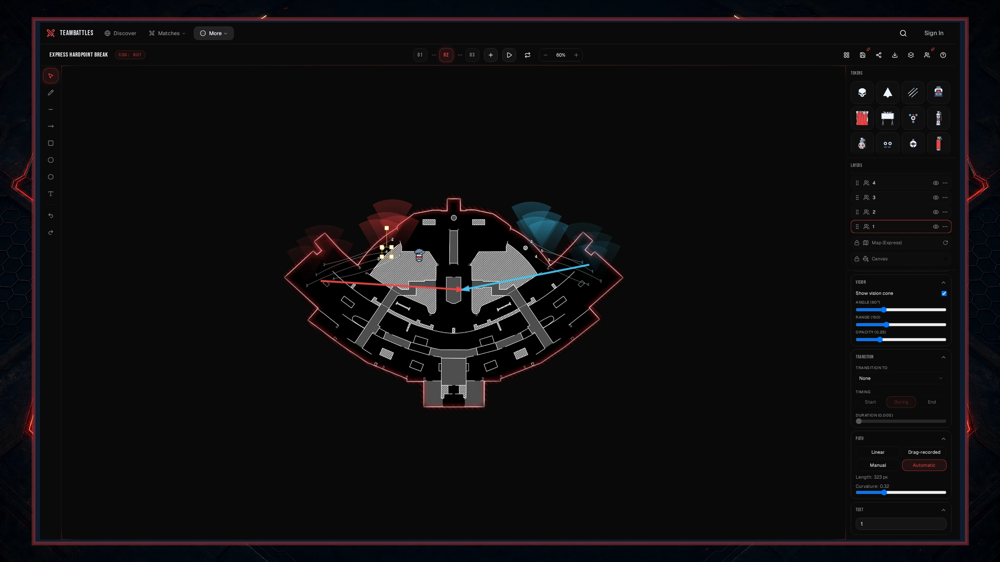

When a token moves between stages, you decide how it gets there. Motion paths show up in the editor
as curves and play out smoothly when you press play or export an animation.

<Frame>
	
</Frame>

## Three ways to make one

### Drag it (the default)

Drag a token on a new stage and the route your cursor takes becomes the path. Whatever you trace is
what the token follows.

### Draw it by hand

Switch to **Manual** in the **Motion path** section of the Properties panel and the path becomes
editable on the board:

- **Double-click the path** to add a point where you clicked.
- **Drag a point** to bend the curve.
- **Right-click a point** to remove it.

You can have up to 32 points on one path.

### Let it curve for you

Switch to **Automatic** and the path bows out into a curve on its own. The **Curvature** slider
controls how far it bows - all the way down is a straight line.

## Moving a token afterwards

A path is tied to where the token starts and where it ends. Move either end later and the path
stretches to match, so you do not have to draw it again.

## Starting over

Choose **Linear** in the Properties panel to clear the path and go back to a straight line.

## Which way the token faces

Draw a path on a **player token** and the editor turns the token to face the way it is going - along
the path at the start, and along the path at the end. Your player is looking where they are running
rather than staying frozen facing the wrong way.

This happens however you made the path: by dragging, by editing points, or by using the curvature
slider.

<Note>
	Only player tokens turn to follow their path. Equipment, objectives, and other markers keep
	whatever rotation you gave them.
</Note>

### One thing to watch

Drawing a new path on a player token **replaces** any rotation you set by hand at either end. If you
want a particular facing, set it after you draw the path - it will stay that way until you redraw
the path.

A future version will let you turn off the automatic turning so hand-set rotations survive. For now,
draw the path first and set the facing second.
