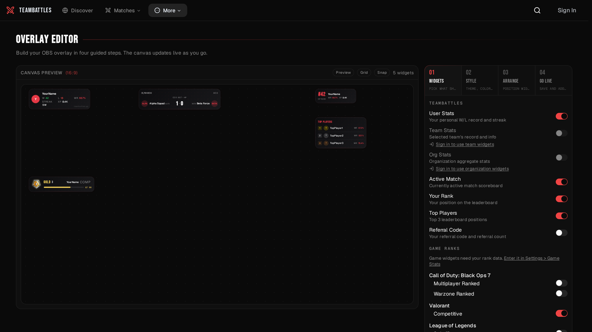
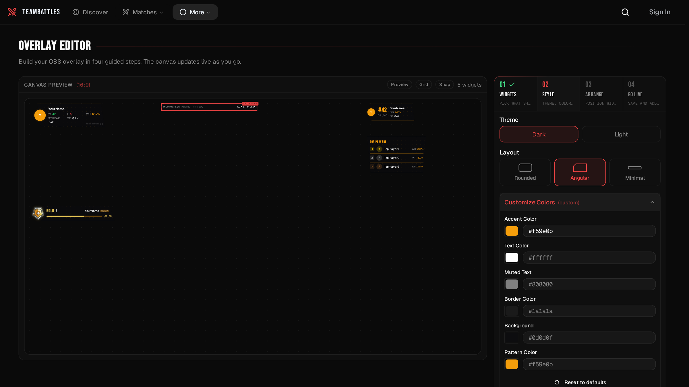
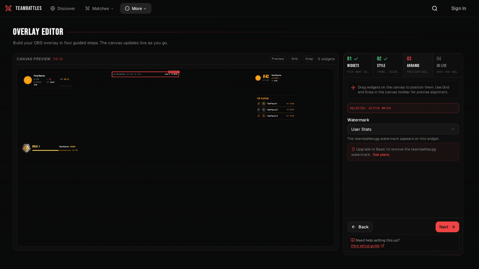

The overlay editor walks you through four steps: pick your widgets, style them, arrange them, and go
live. Open it at [teambattles.gg/overlay/editor](https://teambattles.gg/overlay/editor).

Your finished overlay is a link. Save your work, copy the link, paste it into your streaming
software. There is no password in it and nothing else to configure.

## How the editor is laid out

The screen splits in two:

- **The preview** on one side shows your overlay exactly as it will appear on a 1920 x 1080 stream,
  including the watermark. It updates as you change things.
- **The steps** on the other: **Widgets**, **Style**, **Arrange**, and **Go Live**.



### Moving between steps

- On a **new overlay**, steps unlock as you go. If one is still locked, the reason appears under the
  step list - usually no widgets turned on yet, or a team still to be chosen.
- On a **saved overlay**, you can jump to any step.
- After your first save, you land back on **Go Live**, where your link is.

### Your saved overlays

Under the preview, **Your Overlays** lists everything you have saved, each card showing its name and
how many widgets it uses. The one you are working on is marked **Editing**; select another card to
switch to it. A counter in the header tracks how many of your five slots are used and turns red when
you are full.

**New overlay** starts from scratch. It is unavailable if you are already on a blank overlay, or if
all five slots are used - delete one to free a slot. Unsaved work always gets a confirmation before
you leave it.

## Step 1: Widgets

Turn on what you want to show. Only what is turned on appears in the preview and on your stream.

- **TeamBattles** - User Stats, Team Stats, Org Stats, Active Match, Your Rank, Top Players, and
  Referral Code.
- **Game ranks** - one switch per ranked mode, such as BO7 Ranked Play or Valorant Competitive. Your
  rank data comes from [Settings > Game Stats](https://teambattles.gg/settings/game-stats).

The [Widgets](/tools/battles-overlay/widgets) page covers what each one shows.

### Choosing a team or organization

Turning on **Team Stats** or **Org Stats** opens a picker underneath so you can say which one to
show.

- Signed out, or not on any team, and the widget is unavailable with a link to fix it.
- Choose a private team or organization and a warning tells you the widget will be empty on stream.
  Making it public fixes it - see [Visibility and Privacy](/tools/battles-overlay/visibility).

## Step 2: Style

Set the look of the whole overlay.

### Layout

| Layout  | Looks like                                                                |
| ------- | ------------------------------------------------------------------------- |
| Rounded | Soft corners and gentle gradients. The default.                           |
| Angular | Sharp esports-broadcast styling with angled edges and accent-colored trim. |
| Minimal | Stripped back and compact - small text, small avatars, single rows.        |

### Global controls

| Setting              | What it does                                       | Default |
| -------------------- | -------------------------------------------------- | ------- |
| Theme                | Light or dark                                      | Dark    |
| Background opacity   | How see-through the widget backgrounds are         | 80%     |
| Text opacity         | How see-through the text is                        | 100%    |
| Size                 | Scales every widget together, from 0.5x to 2x      | 1.0     |
| Animated             | Effects on game widgets, such as a winstreak flame | On      |
| Vertical Orientation | Stands game widgets upright                        | Off     |

**Animated** and **Vertical Orientation** only appear once you have a game rank widget turned on.

### Colors

Open **Customize Colors** to set an accent color, and optionally your own text, muted text, border,
and background colors. Rounded and Angular also let you color their background pattern. Enter colors
as a six-digit hex value such as `#22D3EE`.

### Mixing layouts

The **Widget styles** list shows every widget you have on, with the layout it is using -
**Global - Rounded** when it follows the overlay, or **Custom - Minimal** when it has its own. Give
an individual widget a different layout to mix them; choose the same one as the overlay to put it
back on **Global**.



## Step 3: Arrange

Drag widgets around the preview. A label shows which one is selected.

| To do this | Do that                                                              |
| ---------- | -------------------------------------------------------------------- |
| Select     | Click a widget                                                       |
| Move       | Drag it                                                              |
| Nudge      | Arrow keys move it a little, Shift and arrow keys move it further     |
| Deselect   | Click an empty part of the preview                                   |

<Tip>Widgets stop at the edges of the preview, so nothing ends up off-screen on your stream.</Tip>

### Grid and snapping

**Grid** and **Snap** sit in the toolbar above the preview.

- **Grid** draws alignment lines across the preview. With it off you get a faint dot pattern instead.
- **Snap** pulls widgets into line as you drag them - with the grid, with other widgets' edges, and
  with the centre of the screen. Coloured guides appear while you drag and vanish when you let go.

<picture>
	<source
		media="(prefers-reduced-motion: reduce)"
		srcSet="../../images/tools/battles-overlay/preview-3.png"
	/>
	
</picture>

### Watermark

On a free account, a small "teambattles.gg" watermark sits on one of your widgets, and you choose
which one here. The preview shows it exactly where it will land on stream.

Upgrading to Basic ($4.99/mo) or higher removes it, and this picker is replaced by a note saying so.

## Step 4: Go Live

Name your overlay, save it, and copy your link.

- **Name** - required before you can save.
- **Refresh** - how often the overlay picks up new stats, from 30 to 300 seconds. Sixty is the
  default.
- **Save** - needs you to be signed in. You can keep five overlays; once you have five, you have to
  delete one before creating another.

### Your overlay link

Saving gives you a link with a copy button. It looks like this:

```text
https://teambattles.gg/overlay/render/your-overlay-id
```

That link is the whole thing. Paste it into your streaming software and your overlay appears.

### One link per widget

Go Live also lists a separate link for each widget you have turned on, each with its own copy
button. Use these when you would rather place widgets individually in your streaming software than
arrange them here.

### Getting it onto your stream

The step finishes with instructions for OBS: add a **Browser** source, paste the link, and set it to
**1920 x 1080 at 30 FPS**. The [Setup Guide](/tools/battles-overlay/setup) has the same steps for
other streaming apps.

## Nothing gets lost

- Leaving the editor or switching overlays with unsaved changes asks you first, and so does closing
  the browser tab.
- A new overlay you have not saved yet is kept in your browser as you build it. It survives signing
  in, so you come back to "Restored your unsaved overlay draft" rather than an empty editor.

## Preview it first

**Preview** in the toolbar opens your overlay in a new tab filled with sample data, so you can check
how it reads before putting it on stream.
