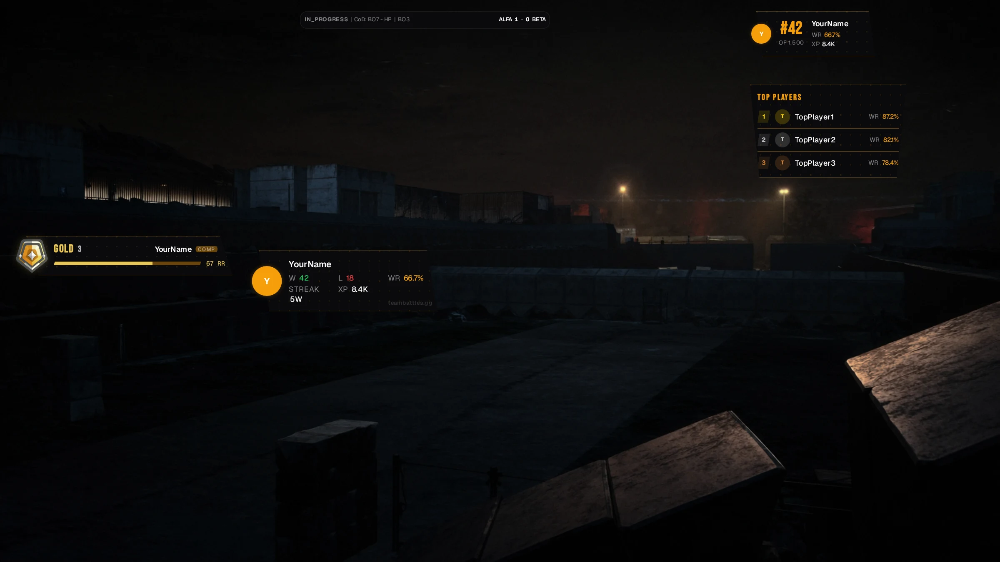

Put your TeamBattles stats on stream. Wins, losses, streaks, live match scores, leaderboard
placings, and game ranks appear on your broadcast and keep themselves up to date while you play.

## What you get

<CardGroup cols={2}>
	<Card title="Seven widgets, plus game ranks" icon="grid-2">
		Your stats, team stats, organization stats, live match, leaderboard placing, top players,
		referral code, and a rank widget for each game you play.
	</Card>
	<Card title="Drag-and-drop editor" icon="paintbrush">
		Move widgets around a preview of your stream until they sit where you want them.
	</Card>
	<Card title="Three looks" icon="palette">
		Rounded, Angular, or Minimal - pick one for the whole overlay, or a different one per widget.
	</Card>
	<Card title="Updates itself" icon="rotate">
		Stats refresh on their own, so your overlay is never showing last week's numbers.
	</Card>
	<Card title="See-through background" icon="eye">
		Built to sit on top of your gameplay without a box around it.
	</Card>
	<Card title="Nothing to set up" icon="lock-open">
		Copy one link, paste it into your streaming software, and you are live.
	</Card>
</CardGroup>

## Quick start

<Steps>
	<Step title="Open the editor">
		Go to [teambattles.gg/overlay/editor](https://teambattles.gg/overlay/editor) and sign in.
	</Step>
	<Step title="Build your overlay">
		Turn on the widgets you want, drag them into place, and pick a look.
	</Step>
	<Step title="Add it to your stream">
		Copy your overlay link and add it as a browser source in your streaming software.
	</Step>
</Steps>

For the full walkthrough, see the [Setup Guide](/tools/battles-overlay/setup).

## Works with your streaming software

Your overlay is a web page, so it works anywhere you can add a web page as a source:

- **OBS Studio** - the most widely used free option
- **Streamlabs Desktop** - OBS-based, with built-in alerts and themes
- **XSplit Broadcaster**
- **Meld Studio**
- **Prism Live Studio**
- **TikTok LIVE Studio** - uses a source called **Link** rather than **Browser**

The [Setup Guide](/tools/battles-overlay/setup) has steps for each one.

## No account? Use the Simple Overlay

The **Simple Overlay** puts a single game rank on your stream without signing in. Pick your game,
type in your details, copy the link.

[Try the Simple Overlay](/tools/battles-overlay/simple)

## Run it from inside OBS

OBS Studio users can add a Battles Overlay panel to OBS itself, and turn widgets on and off without
switching to a browser.

[Learn about the OBS dock](/tools/battles-overlay/dock)

## Learn more

<CardGroup cols={2}>
	<Card title="Setup Guide" icon="rocket" href="/tools/battles-overlay/setup">
		Get your overlay onto your stream, step by step.
	</Card>
	<Card title="Simple Overlay" icon="bolt" href="/tools/battles-overlay/simple">
		A game rank on stream, no account needed.
	</Card>
	<Card title="OBS Dock" icon="window" href="/tools/battles-overlay/dock">
		Manage your overlay from inside OBS Studio.
	</Card>
	<Card title="Widgets" icon="grid-2" href="/tools/battles-overlay/widgets">
		What each widget shows and how big it is.
	</Card>
	<Card title="Editor Guide" icon="paintbrush" href="/tools/battles-overlay/editor">
		Every option in the overlay editor.
	</Card>
	<Card title="Visibility and Privacy" icon="lock-open" href="/tools/battles-overlay/visibility">
		Why a widget might be empty, and what your viewers can see.
	</Card>
	<Card
		title="Troubleshooting"
		icon="circle-question"
		href="/tools/battles-overlay/troubleshooting"
	>
		Fixes for the problems that come up most.
	</Card>
</CardGroup>
