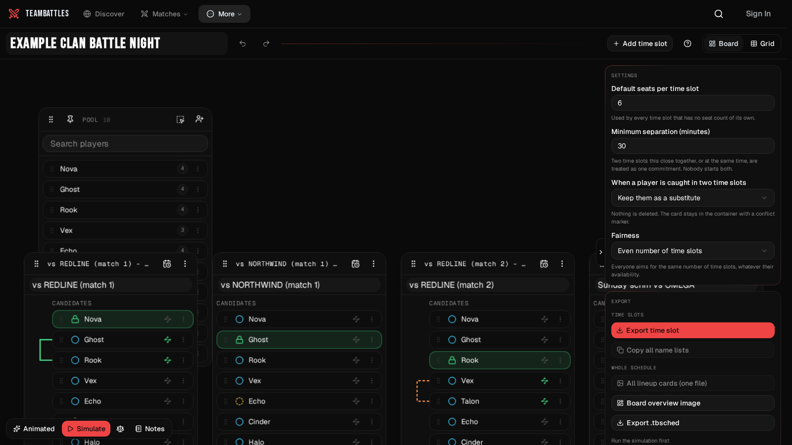
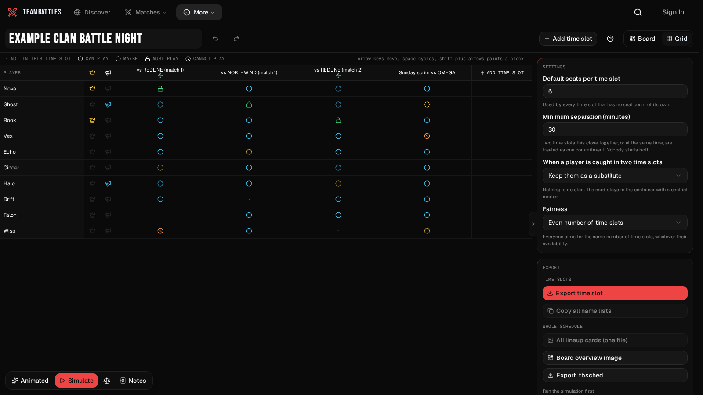

Start with the editable example if you want to explore before building a real schedule. When you are ready, add your roster and create one time slot for each match or scrim.

## Choose Board or Grid

Both views edit the same schedule, so you can switch between them at any time.

| View | Best for |
| --- | --- |
| **Board** | Arranging match times visually, dragging players, making manual lineups, and linking players together or apart. |
| **Grid** | Entering availability quickly across a large roster with mouse or keyboard. |

### Work from the Board

The Board contains a player **Pool** and one container for each time slot. Drag players from the Pool to a time slot, or use a player's menu to move or copy them. You can pan and zoom the canvas, arrange containers, and pin the Pool so it stays in the corner while the rest of the board moves.

### Enter availability in the Grid

The Grid shows players in rows and time slots in columns. Select or drag across cells to change marks. Arrow keys move between cells, Space changes the current mark, and Shift plus an arrow key paints across multiple cells.

Use a player row's actions to set, clear, or invert that row. Use a time slot column's menu to do the same for the column or open its pairing rules.

## Set up each time slot

Each time slot needs a start date and time. You can also add a label, such as an opponent or round, and override the schedule's default number of seats.

The schedule begins in your browser's time zone. If a match was announced in another region, set that time slot to the other region's zone and enter the time exactly as it was given. Battles Scheduler shows the different zone anywhere that time appears.

The **Slot actions** menu also lets you duplicate a time slot, copy players from another slot, assign duties, clear its players, or delete it.

## Mark player availability

Availability belongs to a specific time slot. A player can be available on Saturday and unavailable on Sunday.

| Mark | Use it when |
| --- | --- |
| **Not in this time slot** | The player should not be considered for this time. |
| **Can play** | The player is available normally. |
| **Maybe** | The player can fill in if needed. Battles Scheduler avoids using Maybe players before it tries to fill every seat. |
| **Must play** | The player should start unless your other requirements make that impossible. |
| **Cannot play** | The player is explicitly excluded from this time slot. |

Mark **Can host** or **Can call** on players who can take those duties. Battles Scheduler uses those flags when assigning Host and IGL automatically.

## Add duties and pairing preferences

Open **Duties...** on a time slot to leave Host and IGL on **Auto** or choose a player. Choosing someone does not force them into the lineup; Battles Scheduler warns you if that duty cannot be filled.

Pairing preferences are also set per time slot:

- **Together** asks Battles Scheduler to start or sit both players as a pair.
- **Apart** asks it not to start that pair together.

These are preferences, not hard requirements. Participation, Maybe status, filled seats, and fairness take priority. Any pairing that could not be honored appears in the fairness summary.

## Continue

When your roster and availability are ready, [create balanced lineups](./lineups).
