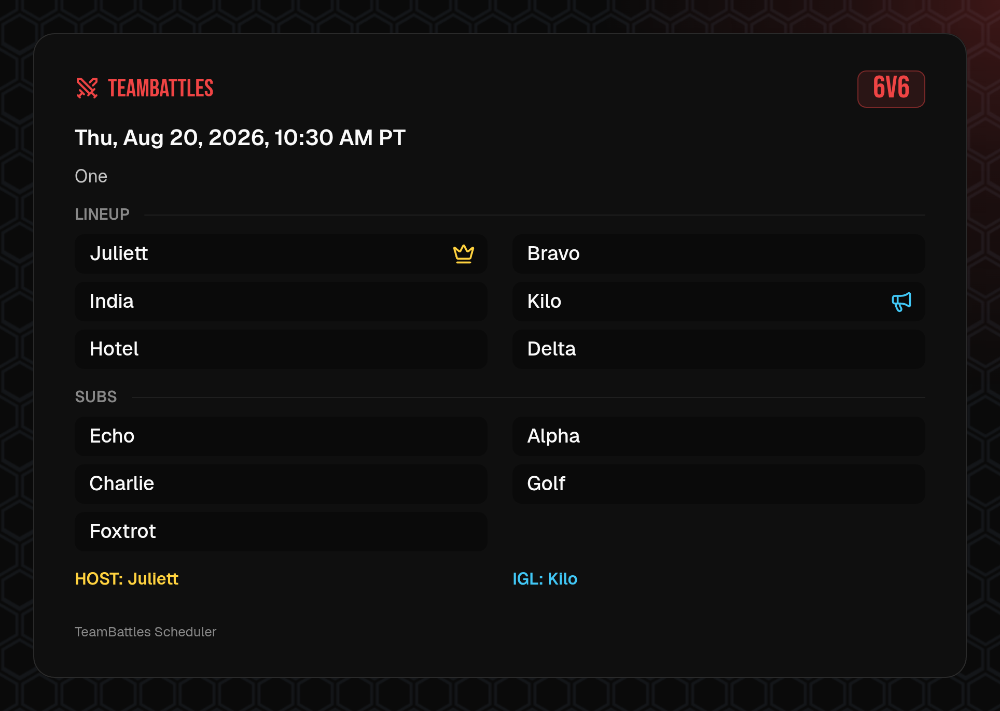
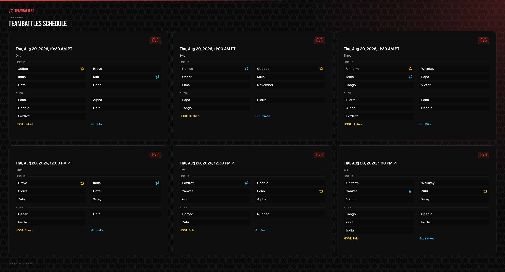
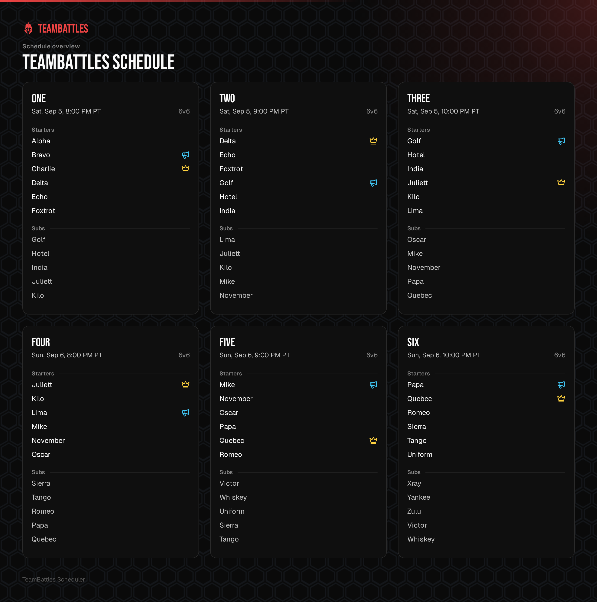

Battles Scheduler creates every export in your browser. Your roster and schedule are not uploaded.

## Share the lineups

| Export | What you get |
| --- | --- |
| **Copy list of names** | The starters and every eligible substitute for one solved time slot. |
| **Copy all name lists** | One text block containing every solved time slot in chronological order. |
| **Download lineup card image** | A share-ready image for one solved time slot. |
| **All lineup cards (one file)** | One image containing every solved time slot. Unsolved time slots are skipped. |
| **Board overview image** | A visual summary of the whole schedule, available even before your first simulation. |

Lineup-card and name-list actions become available after at least one time slot has a computed or manually created lineup. They pause while an animated simulation is still playing.

### Single lineup card

Use a single lineup card when you only need to share one match time. The card includes the starters, substitutes, seat count, start time, and assigned Host and IGL.

Images can be PNG, JPEG, or WebP at 1x, 2x, or 3x. Battles Scheduler can lower the selected scale when the requested image is larger than the browser can safely draw. If a combined sheet is still too large, export each time slot separately.

<Note>
	A stale lineup can still be exported. Images include a stale marker, while copied names match
	the lineup currently shown on the board.
</Note>

### Combined lineup cards

Choose **All lineup cards (one file)** to share every solved time slot in one image. The combined sheet keeps each lineup in its own card and orders the cards chronologically.

### Board overview

The board overview collects every time slot into one image so your whole schedule can travel as a single visual.

## Keep a portable backup

Schedules are saved only in the current browser profile. Export a `.tbsched` file when you want to:

- Protect a schedule before clearing browser data.
- Move it to another browser or device.
- Keep a durable copy outside TeamBattles.
- Use an existing schedule as the starting point for a new one.

**Export .tbsched** is always available from the schedule library and editor. Importing a file creates a normal local schedule and lets you choose which parts to bring over.

<Warning>
	Autosave protects ordinary edits, but it is not a cloud backup. Clearing TeamBattles site data
	deletes every schedule stored in that browser.
</Warning>

## Useful limits

| Item | Limit |
| --- | --- |
| Players | 64 per schedule |
| Time slots | 64 per schedule |
| Relationships | 512 per schedule |
| Seats | 1 to 32 per time slot; 6 by default |
| Minimum separation | 0 to 720 minutes; 30 by default |
| `.tbsched` import | 8 MB |
| Undo history | Up to 50 steps; very large schedules retain at least 5 |

## Troubleshooting

### My schedule disappeared

Schedules exist only in the browser profile where you created or imported them. If site data was cleared, restore the schedule from a `.tbsched` backup.

### The editor is read-only

Use a screen at least 1024 pixels wide. If another tab owns the schedule, select **Take over**. When the tabs cannot communicate, close the editing tab and try **Take over** again.

### Copy or lineup-card export is disabled

Wait for the simulation animation to finish. If you have not created a lineup yet, run the simulation or promote players manually.

### The combined image is too large

Export individual lineup cards, or choose a smaller image scale. If JPEG or WebP fails, try PNG.

### A `.tbsched` file will not import

Confirm that the file was exported by Battles Scheduler, is no larger than 8 MB, and comes from a compatible version.

For browser-wide storage and account help, see [Troubleshooting](../../reference/troubleshooting).
