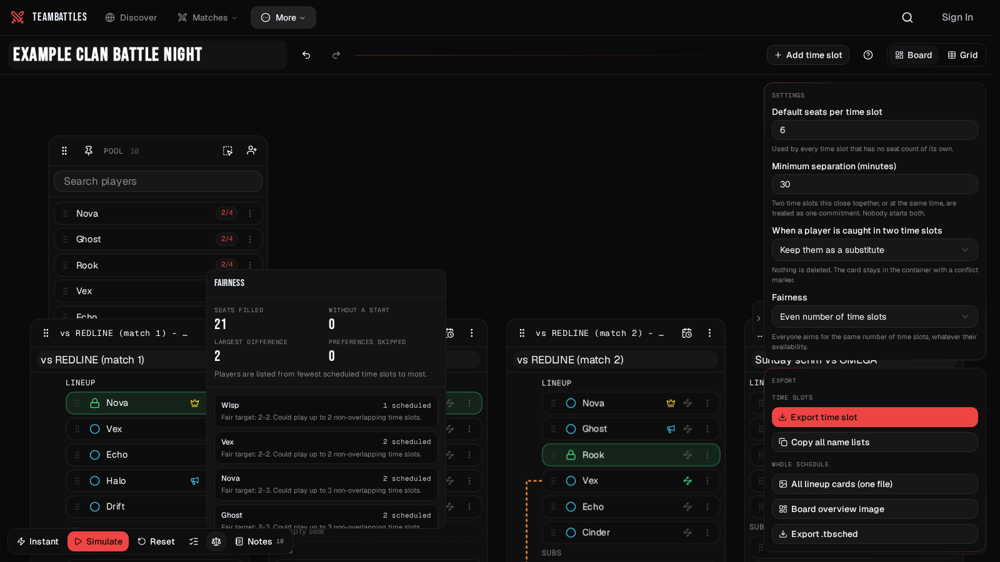

Battles Scheduler creates lineups from the players, availability, and preferences already on your Board or Grid.

## Choose the lineup rules

Open **Settings** and review these choices before your first simulation:

- **Default seats per time slot** sets the normal lineup size. You can override it on individual time slots.
- **Minimum separation** prevents one player from starting time slots that overlap or begin too close together.
- **Overlapping time slots** decides whether a player who loses an overlap remains listed as a substitute or is removed from that time slot.
- **Fairness** chooses how participation is compared:
  - **Even number of time slots** tries to give everyone a similar number of starts.
  - **Even share of time slots** compares each player with the opportunities they could attend. This is useful when some players are available much less often than others.

## Run the simulation

<Steps>
	<Step title="Choose a playback style">
		Select **Animated** to watch the decisions or **Instant** to apply the lineup immediately.
	</Step>
	<Step title="Select Simulate">
		Battles Scheduler builds and applies the lineups. There is no separate confirmation step.
	</Step>
	<Step title="Review the result">
		Open the decision list, **Fairness**, or **Notes** to understand underfilled time slots,
		overlaps, relaxed Must play marks, and unfilled duties.
	</Step>
	<Step title="Resolve blockers if needed">
		Open **Blockers** for contradictory inputs and available fixes, then run the simulation again.
	</Step>
</Steps>

## How lineup decisions are prioritized

Battles Scheduler compares possible results in this order:

1. Avoid leaving available players without any start.
2. Avoid using players marked Maybe.
3. Fill as many seats as possible.
4. Improve the selected fairness measure.
5. Honor together and apart preferences.

Each item takes priority over the ones below it. For example, an open seat can remain empty when filling it would require a Maybe player.

## Adjust or try another result

- **Run again** tries a different valid variation and keeps the current result if the new one is worse.
- **Reset** removes all computed lineups but keeps your players, availability, duties, and pairing preferences.
- **Undo** reverses the entire simulation in one step, including placements removed by the overlapping-time-slot setting.
- Moving players manually lets you make the final call after a simulation.

If you change an input after running, the visible lineup becomes **stale**. You can still export what is on the board, but select **Re-run** when you want a result based on the latest inputs.

## Editing from another tab or a small screen

Only one browser tab edits a given schedule at a time. A second tab opens read-only; select **Take over** to load the latest saved version there and hand editing over from the first tab.

Screens below 1024 pixels wide also use a read-only lineup view. You can review lineups and open Fairness, Blockers, and export controls, but you need a wider screen to change or simulate the schedule.

## Continue

Once the lineup looks right, [export it or create a backup](./exports).
